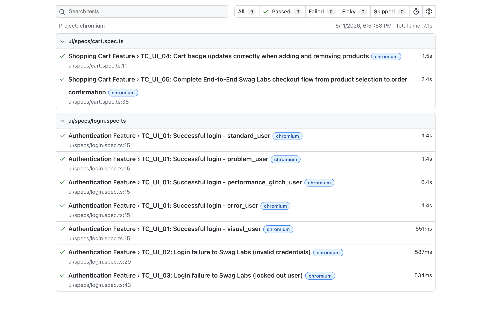
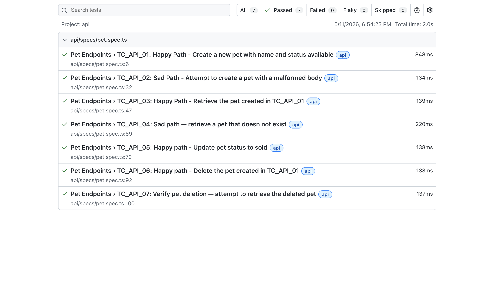

# Betsson QA Engineer Technical Task — Playwright Automation Framework

An end-to-end test automation framework built with **Playwright** and **TypeScript**, covering UI testing for [SauceDemo](https://www.saucedemo.com/) and API testing for the [Petstore API](https://petstore.swagger.io/).

---

## Tech Stack

- **Playwright** — UI and API test framework
- **TypeScript** — Programming language
- **GitHub Actions** — CI/CD pipeline
- **HTML Reporter** — Test reporting

## Architecture

### Why Playwright?

Playwright was chosen as the framework for both UI and API testing for the following reasons:

- Supports both UI and API testing in a single framework, keeping the repository consistent
- Built-in support for TypeScript, multiple browsers, and parallel test execution
- Powerful built-in reporter with detailed HTML reports and trace viewer
- Fast and reliable with auto-waiting built in, reducing flaky tests

### Page Object Model (POM)

The UI tests are built using the **Page Object Model** design pattern. Each page of the application is represented by a dedicated TypeScript class that encapsulates all the selectors and interactions for that page.

**Why POM?**

- **Maintainability** — if a selector changes, it only needs to be updated in one place, not across every test
- **Readability** — tests read like plain English, making them easy to understand
- **Reusability** — page methods can be reused across multiple test files

### Data-Driven Testing

Login tests use a parameterized approach — a single test runs for each valid user type, meaning new user types can be added by updating a single array:

```typescript
const validUsers = [
  'standard_user',
  'problem_user',
  'performance_glitch_user',
  'error_user',
  'visual_user',
];
```

### Arrange / Act / Assert Pattern

All tests follow the **AAA pattern** for consistency and readability:

```typescript
// Arrange — set up what you need

// Act — perform the action

// Assert — verify the result
```

### Dynamic Locators

Rather than hardcoding a separate locator for each product, a single reusable method converts the product name to kebab-case at runtime and builds the locator dynamically. This means the same method works for any product on the page without any changes.

## Part 1: UI Testing — SauceDemo

### Feature 1: Login Functionality

The login page is the application entry point. It supports multiple user roles that simulate different states.

**TC_UI_01 — Happy Path:** Successful login for all valid users using a parameterized approach. The same test runs for `standard_user`, `problem_user`, `performance_glitch_user`, `error_user`, and `visual_user`. Expected result: user is redirected to the inventory page.

**TC_UI_02 — Sad Path:** Login attempt with invalid credentials. Expected result: error message is displayed.

**TC_UI_03 — Sad Path:** Login attempt with `locked_out_user`. This user is
intentionally excluded from the parameterized login test since it cannot
authenticate. Expected result: correct locked out error message is displayed.

### Feature 2: Shopping Cart & Checkout

The shopping cart is the core e-commerce feature, covering product selection through to order confirmation.

**TC_UI_04 — Happy Path:** Add multiple products to the cart, verify the cart badge increments correctly, remove one product, and verify it is no longer in the cart.

**TC_UI_05 — Happy Path:** Complete end-to-end checkout flow from product selection to order confirmation, including filling checkout information, reviewing the order summary, and logging out.

### Notable Observations

- `performance_glitch_user` consistently takes ~6 seconds to load the inventory page — by design, simulating a slow system. All other users load in under 1.5 seconds.

### UI Test Results



**9 tests passing across 2 spec files.**

---

## Part 2: API Testing — Petstore API

The API tests follow a full **Create → Retrieve → Update → Delete** journey for the `/pet` endpoint. A `petId` is shared across tests using a variable declared outside the test suite, and tests run in serial mode to ensure correct ordering.

**TC_API_01 — POST — Happy Path:** Create a new pet with name `Laika` and status `available`. Expected result: 200 OK, response body echoes name, status, and a valid id.

**TC_API_02 — POST — Sad Path:** Attempt to create a pet with a malformed body. Expected result: not a 2xx response.

**TC_API_03 — GET — Happy Path:** Retrieve the pet created in TC_API_01 using its id. Expected result: 200 OK, body matches creation data.

**TC_API_04 — GET — Sad Path:** Retrieve a pet that does not exist. Expected result: 404 Not Found.

**TC_API_05 — PUT — Happy Path:** Update the pet status to `sold`. Expected result: 200 OK, response body reflects updated status.

**TC_API_06 — DELETE — Happy Path:** Delete the pet created in TC_API_01. Expected result: 200 OK.

**TC_API_07 — GET — Verification:** Attempt to retrieve the deleted pet. Expected result: 404 Not Found, confirming the pet is truly gone.

### Notable Observations

- **Integer precision issue** — the Petstore API returns large integer IDs that exceed JavaScript's `MAX_SAFE_INTEGER`, causing precision loss when parsed. To avoid this, an explicit ID is supplied using `Date.now()`, which always falls within the safe integer range.
- **Negative test assertions** — for TC_API_02, `not.toBe(200)` is used instead of a specific error code, since the public demo API does not guarantee consistent error status codes for malformed requests.
- **Serial test execution** — API tests run in serial mode since each test depends on the shared `petId` from TC_API_01.

### API Test Results



**7 tests passing.**

---

## How to Run Tests

Install dependencies:

```bash
npm install
npx playwright install
```

Run all tests:

```bash
npx playwright test
```

Run UI tests only:

```bash
npx playwright test --project=chromium
```

Run API tests only:

```bash
npx playwright test --project=api
```

View HTML report:

```bash
npx playwright show-report
```

---

## CI/CD

Tests run automatically on every push via **GitHub Actions**. The workflow is located at `.github/workflows/playwright.yml`.
